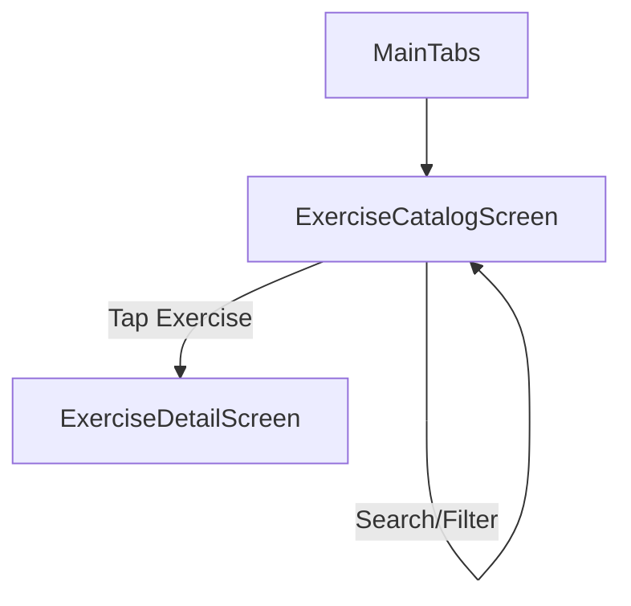

# Epic 0.3 — ExerciseCatalogScreen

## Artifact 1 — UI Flow Map

## Artifact 2 — UI Spec (Layout + States)
### Layout
- **Header**: "Exercise Library" (Large Title).
- **Search Bar**: Sticky at top, magnifying glass icon, clear button.
- **Filters Row**:
  - Muscle Group: Single-select chips or dropdown.
  - Equipment: Multi-select horizontally scrollable chips.
- **Results List**:
  - FlatList of cards.
  - Card content: Name (bold), Muscle Tags (secondary color), Equipment Tags (outline).
  - Disclosure indicator (chevron) on the right.

### States
- **Loading**: Centered ActivityIndicator.
- **Empty**: "No exercises match your search." with a "Clear Filters" button.
- **Error**: "Failed to load library" + "Retry" button.

## Artifact 3 — Component Tree
- `ExerciseCatalogScreen` (Container)
  - `SafeAreaView`
    - `Header` ("Exercise Library")
    - `SearchBar` (Debounced Input)
    - `FilterSection`
      - `MuscleSelector` (Scrollable Chips)
      - `EquipmentSelector` (Scrollable Chips)
    - `FlatList`
      - `ExerciseListItem` (Card)
        - `NameText`
        - `TagCloud` (Muscles + Equipment)

## Artifact 4 — Navigation Contract
- **Route Name**: `ExerciseCatalog`
- **Params**: `undefined`
- **Navigates to**: `ExerciseDetail` (params: `{ exerciseId: string }`)

## Artifact 5 — Firestore Reads/Writes
> [!NOTE]
> Currently using `MockWorkoutRepo`.
- `getExercises()`: Fetches the full static catalog.
- Client-side filtering/searching for MVP.

## Artifact 6 — Firestore Schema Diff
No Firestore changes required (using local JSON).

## Artifact 7 — Security Rules Diff
No changes.

## Artifact 8 — Implementation Plan (React Native)
1. **Model Update**: Refactor `Exercise` interface in `IWorkoutRepository.ts` to support optional description and array-based equipment.
2. **Debounce Logic**: Use `lodash.debounce` or a custom hook to delay the search filtering by 350ms.
3. **Filtering Logic**: 
   - Filter by name (case-insensitive).
   - Filter by single muscle group (if selected).
   - Filter by equipment list (intersecting with selected chips).
4. **UI Styling**: Use `Colors.primary` for active chips and `Colors.brandDarkBlue` for background.
5. **Optimization**: Use `memo` for `ExerciseListItem` to prevent unnecessary re-renders during search.

## Artifact 9 — Analytics Events
- `catalog_viewed`: {}
- `search_performed`: { queryLength: number }
- `filter_applied`: { muscle: string, equipmentCount: number }
- `exercise_opened`: { exerciseId: string }

## Artifact 10 — Test Checklist
- [ ] Verify search triggers after 350ms pause.
- [ ] Verify muscle filter shows only relevant exercises.
- [ ] Verify multiple equipment filters narrow down results.
- [ ] Verify empty state appears when query yields no results.
- [ ] Verify navigation to `ExerciseDetail` passes correct ID.

## Artifact 11 — Evidence Checklist
- **EVID-P0.3-ExerciseCatalog-001**: Screenshot: Library with full list and header.
- **EVID-P0.3-ExerciseCatalog-002**: Screenshot: Search query active with filtered results.
- **EVID-P0.3-ExerciseCatalog-003**: Screenshot: Multi-chip equipment filter applied.
- **EVID-P0.3-ExerciseCatalog-004**: Screenshot: Empty state.

## Acceptance Criteria
- Search is responsive and debounced.
- Filters persist while searching.
- Performance remains smooth with 20+ exercises.
- Navigation to details is immediate upon tap.
