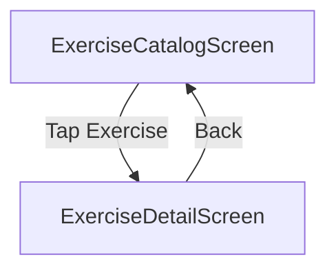

# Epic 0.3 — ExerciseDetailScreen

## Artifact 1 — UI Flow Map

## Artifact 2 — UI Spec (Layout + States)
### Layout
- **Header**: Exercise name (Title).
- **Hero Area**: 
  - Media placeholder (16:9 aspect ratio).
  - Overlay "Demo media coming soon" if missing.
- **Metadata Row**:
  - Horizontal scroll of chips: Difficulty (badge colored), Muscles (tags), Equipment (tags).
- **Instructions Section**:
  - Heading: "How to perform"
  - Ordered list for steps (if array) or bullet points (if newline separated string).

### States
- **Loading**: Centered ActivityIndicator.
- **Error**: "Failed to load details" + "Retry" button.
- **Not Found**: "Exercise not found" + "Go Back" button.

## Artifact 3 — Component Tree
- `ExerciseDetailScreen` (Container)
  - `SafeAreaView`
    - `Header` (Custom implementation with Back Button)
    - `ScrollView`
      - `HeroMedia` (Placeholder or Video)
      - `InfoSection`
        - `NameTitle`
        - `ChipRow`
      - `InstructionSection`
        - `SectionTitle`
        - `StepList`

## Artifact 4 — Navigation Contract
- **Route Name**: `ExerciseDetail`
- **Params**: `{ exerciseId: string }`
- **Returns to**: `ExerciseCatalog` via `navigation.goBack()`

## Artifact 5 — Firestore Reads/Writes
- `getExercise(exerciseId)`: Fetches a single exercise document from the mock catalog.

## Artifact 6 — Firestore Schema Diff
No changes needed.

## Artifact 7 — Security Rules Diff
No changes needed.

## Artifact 8 — Implementation Plan (React Native)
1. **Param Extraction**: Use `useRoute` or navigation props to retrieve `exerciseId`.
2. **Data Fetching**: Call `repo.getExercise` inside `useEffect`.
3. **Responsive Rendering**: Build a flexible layout that handles varying instruction lengths.
4. **Media Placeholder**: Create a styled `View` for the media area with a "Play" icon overlay to simulate future video.
5. **Back Navigation**: Ensure the native back button and header back button are correctly handled.

## Artifact 9 — Analytics Events
- `exercise_detail_viewed`: { exerciseId: string }

## Artifact 10 — Test Checklist
- [ ] Verify correct exercise data loads for given ID.
- [ ] Verify back button returns to Catalog with state (search/filters) preserved.
- [ ] Verify instructions handle both string and array formats.
- [ ] Verify loading indicator appears during fetch.
- [ ] Verify "Not Found" state for invalid IDs.

## Artifact 11 — Evidence Checklist
- **EVID-P0.3-ExerciseDetail-001**: Screenshot: Full detail view (Barbell Squat).
- **EVID-P0.3-ExerciseDetail-002**: Screenshot: Scrolling down to instructions.
- **EVID-P0.3-ExerciseDetail-003**: Screenshot: Error/Retry state.
- **EVID-P0.3-ExerciseDetail-004**: Screenshot: "Not Found" state.

## Acceptance Criteria
- Full exercise metadata is displayed correctly.
- Instructions are legible and properly formatted.
- Navigation back to catalog is seamless.
- No memory leaks from repeated detail views.
