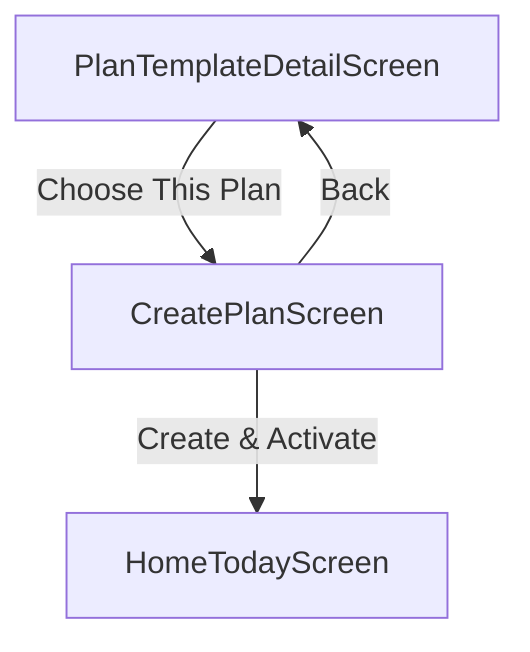

# CreatePlanScreen (P0.4)

## Artifact 1 — UI Flow Map

## Artifact 2 — UI Spec (Layout + States)
| UI Element | Layout Type | Description |
| :--- | :--- | :--- |
| **Header** | Sticky Header | Title "Set your schedule" |
| **Day Picker** | Multi-select Grid | Mon–Sun selector. Highlight selected days. |
| **Settings Preview** | Card List | Read-only summary of `sessionMinutes` and `equipment`. |
| **Validation Message** | Text | Soft nudge if selected days < template days/week. |
| **Primary CTA** | Fixed Bottom | "Create & Activate Plan" (Enabled only if >= 1 day selected). |

### States
- **Loading**: Fetching template and user profile.
- **Validating**: Checking if at least one day is selected.
- **Saving**: Loading indicator on button during repository write.
- **Success**: Instant redirect to Home.

## Artifact 3 — Component Tree
- `CreatePlanScreen` (Container)
  - `SafeAreaView`
    - `Header`
    - `ScrollView`
      - `ScheduleSection`
        - `DaySelectorGrid` (7 Days)
      - `PreferencesSummary` (Read-only)
        - `SessionMinutesRow`
        - `EquipmentSummaryRow`
    - `ActionFooter`
      - `ActivateButton`

## Artifact 4 — Navigation Contract
- **CreatePlan** (params: `{ templateId: string }`)
- **HomeToday** (Success target)

## Artifact 5 — Firestore Reads/Writes
> [!NOTE]
> Mock Implementation. Mapping for future:
- **Read**: `planTemplates/${templateId}`
- **Read**: `users/${uid}` (Profile preferences)
- **Write**: `users/${uid}/plans` (New plan document)
- **Update**: `users/${uid}/activePlanId` (Point to new plan)

## Artifact 6 — Firestore Schema Diff
No changes needed (Assumes `plans` subcollection structure).

## Artifact 7 — Security Rules Diff
No changes needed.

## Artifact 8 — Implementation Plan (React Native)
### 1. Repository
- Update `MockWorkoutRepository` to implement `createUserPlan` and `activatePlan`.
- `createUserPlan` generates a random ID, saves to a temporary list or session storage.
- `activatePlan` updates the "active" status for all user plans (ensuring only one is active).

### 2. UI Development
- Update `CreatePlanScreen.tsx`.
- Build a custom `DayPicker` component.
- Populate defaults from user profile and template requirements.

### 3. Logic & Navigation
- Implement validation (min 1 day).
- Call repository methods on CTA press.
- Track analytics events.

## Artifact 9 — Analytics Events
- `create_plan_viewed`: Params `{ templateId: string }`.
- `schedule_selected`: Params `{ countDays: number }`.
- `plan_created`: Params `{ planId: string, templateId: string }`.
- `plan_activated`: Params `{ planId: string }`.

## Artifact 10 — Test Checklist
- [ ] Select 0 days, verify button is disabled or show validation.
- [ ] Select 3 days for a 4-day plan, verify soft nudge message.
- [ ] Complete creation and verify redirection to Home.
- [ ] Verify newly created plan is shown as "Active" on Home.

## Artifact 11 — Evidence Checklist
- **EVID-P0.4-CreatePlan-001**: Screenshot: Schedule picker with selected days.
- **EVID-P0.4-CreatePlan-002**: Screenshot: Validation nudge (fewer days than template).
- **EVID-P0.4-CreatePlan-003**: Video: Full creation to activation flow.

## Acceptance Criteria
- User can select training days.
- Defaults are intelligently populated.
- Navigation to Home occurs only after successful persistence.
- Activation enforces single-active-plan rule via repository.
