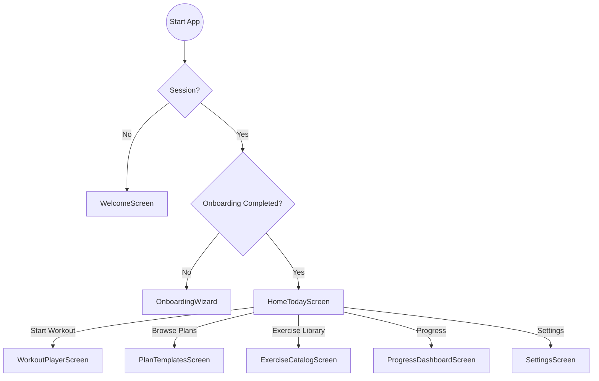

# HomeTodayScreen (P0.4)

## Artifact 1 — UI Flow Map

## Artifact 2 — UI Spec (Layout + States)
| UI Element | Layout Type | Description |
| :--- | :--- | :--- |
| **Greeting Header** | Row | Greeting ("Ready for your workout?") + Mini Goal Chip. |
| **Today's Workout Card** | Vertical Card (Large) | Title, Time est, Exercise count. Large "Start" button. |
| **Empty State Card** | Vertical Card (Large) | "No active plan found" message + "Choose Plan" primary button. |
| **Metrics Summary** | Horizontal Row | "Streak" count + "Weekly Volume" bar chart/snippet. |
| **Quick Actions** | 2x2 Grid | Iconic buttons for Catalog, Plans, History, Settings. |

### States
- **Loading**: Pulse animation on cards.
- **Error**: Full-screen error overlay with "Retry" button.
- **Empty**: Swaps Today's Workout Card with an Onboarding-style CTA.

## Artifact 3 — Component Tree
- `HomeTodayScreen` (Container)
  - `SafeAreaView`
    - `ScrollView`
      - `HomeHeader`
        - `Greeting`
        - `GoalChip`
      - `WorkoutHero` (Conditional)
        - `ActiveWorkoutContent` (Workout name, details)
        - `StartButton`
      - `EmptyPlanSplash` (Conditional)
        - `Message`
        - `ChoosePlanButton`
      - `StatsSection`
        - `MetricCard` (Streak)
        - `MetricCard` (Volume)
      - `QuickActionGrid`
        - `ActionItem` (Catalog)
        - `ActionItem` (Plans)
        - `ActionItem` (Progress)
        - `ActionItem` (Settings)

## Artifact 4 — Navigation Contract
- **HomeToday** `(tab)`
- **PlanTemplates** (route: `PlanTemplates`)
- **WorkoutPlayer** (route: `WorkoutPlayer`, params: `{ planId: string }`)
- **ExerciseCatalog** (route: `ExerciseCatalog`)
- **ProgressDashboard** (route: `ProgressDashboard`)
- **Settings** (route: `Settings`)

## Artifact 5 — Firestore Reads/Writes
> [!NOTE]
> Currently using `WorkoutRepo` (Mock). Mapping for future Firestore:
- **Read**: `users/${uid}` (Profile & Goal)
- **Read**: `users/${uid}/activePlan` (Current schedule)
- **Read**: `users/${uid}/metrics` (Streak & Volume)

## Artifact 6 — Firestore Schema Diff
No changes needed to existing `UserProfile` or `WorkoutLog` structures.

## Artifact 7 — Security Rules Diff
No changes needed.

## Artifact 8 — Implementation Plan (React Native)
### 1. Repository Extensions
- Ensure `MockWorkoutRepository` has robust `getActivePlan` and `getMetrics` logic.
- Add `saveActivePlan` helper if needed for testing.

### 2. UI Implementation
- Update `HomeTodayScreen.tsx`.
- Use `Colors.brandDarkBlue` for background and `brandPurple` for CTAs.
- Implement `useEffect` to fetch profile, plan, and metrics on mount.

### 3. Polish
- Add `ActivityIndicator` for loading state.
- Handle null `activePlan` with the CTA card.

## Artifact 9 — Analytics Events
- `home_viewed`: On screen mount.
- `start_workout_clicked`: On hero CTA.
- `choose_plan_clicked`: On empty state CTA.
- `quick_action_clicked`: Params: `{ actionName: string }`.

## Artifact 10 — Test Checklist
- [ ] Load Home with Guest UID.
- [ ] Verify streak number displays from `getMetrics`.
- [ ] Toggle "No Active Plan" state manually in repo to verify UI switch.
- [ ] Click "Start Workout" and verify navigation to `WorkoutPlayer`.

## Artifact 11 — Evidence Checklist
- **EVID-P0.4-HomeToday-001**: Screenshot: Full Home screen with active workout.
- **EVID-P0.4-HomeToday-002**: Screenshot: Home screen with "No Active Plan".
- **EVID-P0.4-HomeToday-003**: Video: Refresh behavior and navigation.

## Acceptance Criteria
- HomeToday renders user goal and name (if available).
- Today's Workout card shows specific details when a plan is active.
- Empty state appears correctly when no plan is active.
- Quick actions navigate to their respective screens.
- Loading indicator shown during initial data fetch.
