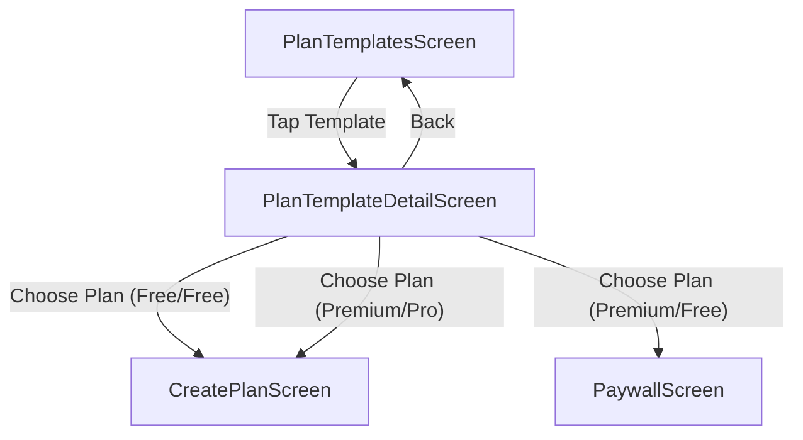

# PlanTemplateDetailScreen (P0.4)

## Artifact 1 — UI Flow Map

## Artifact 2 — UI Spec (Layout + States)
| UI Element | Layout Type | Description |
| :--- | :--- | :--- |
| **Hero Header** | Vertical Stack | Large Title, Level Badge, Frequency Badge, Premium Ribbon. |
| **Description** | Text Block | `shortDescription` with styled typography. |
| **Day Preview** | Horizontal Scroll | Horizontal list showing "Day 1", "Day 2", etc. |
| **Exercise List** | Vertical List | Exercises included in the template (preview mode). |
| **Primary CTA** | Fixed Bottom | "Choose This Plan" button with price/premium context. |

### States
- **Loading**: Pulse skeletons for text and badges.
- **Error**: Error message with "Go Back" and "Retry".
- **Not Found**: "Template not found" with 404-style icon and redirect Home.

## Artifact 3 — Component Tree
- `PlanTemplateDetailScreen` (Container)
  - `SafeAreaView`
    - `ScrollView`
      - `DetailHeader` (Title, Badges)
      - `DescriptionBox`
      - `SectionHeader` ("Weekly Preview")
      - `HorizontalDayPicker`
      - `ExercisePreviewList`
        - `ExerciseItem`
    - `ActionFooter`
      - `PrimaryButton` ("Choose This Plan")

## Artifact 4 — Navigation Contract
- **PlanTemplateDetail** (params: `{ templateId: string }`)
- **CreatePlan** (params: `{ templateId: string }`)
- **Paywall** (params: `{ source: string, templateId: string }`)

## Artifact 5 — Firestore Reads/Writes
> [!NOTE]
> Mock Implementation. Mapping for future:
- **Read**: `planTemplates/${templateId}`
- **Read**: `users/${uid}` (Check premium entitlement status)

## Artifact 6 — Firestore Schema Diff
No changes needed.

## Artifact 7 — Security Rules Diff
No changes needed.

## Artifact 8 — Implementation Plan (React Native)
### 1. Repository
- Use `repo.getPlanTemplate(templateId)` to fetch data on mount.
- Fetch `profile` to check for premium status (mock logic: `isPremium` from template + `isProfessional` from profile).

### 2. UI Development
- Update `PlanTemplateDetailScreen.tsx`.
- Implement high-fidelity header with brand colors.
- Build exercise block preview.

### 3. Logic & Navigation
- Implement `handleChoosePlan` with conditional gating (Paywall vs Create).
- Track analytics events.

## Artifact 9 — Analytics Events
- `plan_template_detail_viewed`: Params `{ templateId: string }`.
- `choose_plan_clicked`: Params `{ templateId: string }`.
- `paywall_redirected`: Params `{ templateId: string, source: "premium_plan_detail" }`.

## Artifact 10 — Test Checklist
- [ ] Load screen with valid `templateId`.
- [ ] Load screen with invalid `templateId` (Verify 404 state).
- [ ] Tap "Choose This Plan" on a free plan (Verify navigation to `CreatePlan`).
- [ ] Tap "Choose This Plan" on a premium plan as a free user (Verify navigation to `Paywall`).

## Artifact 11 — Evidence Checklist
- **EVID-P0.4-PlanTemplateDetail-001**: Screenshot: Full detail view.
- **EVID-P0.4-PlanTemplateDetail-002**: Video: Choose plan action (Normal vs Premium).

## Acceptance Criteria
- Screen renders all template metadata (Name, Difficulty, Short Descr).
- Exercise preview correctly lists blocks.
- Primary CTA handles premium gating logic.
- Navigation back to `PlanTemplates` works.
