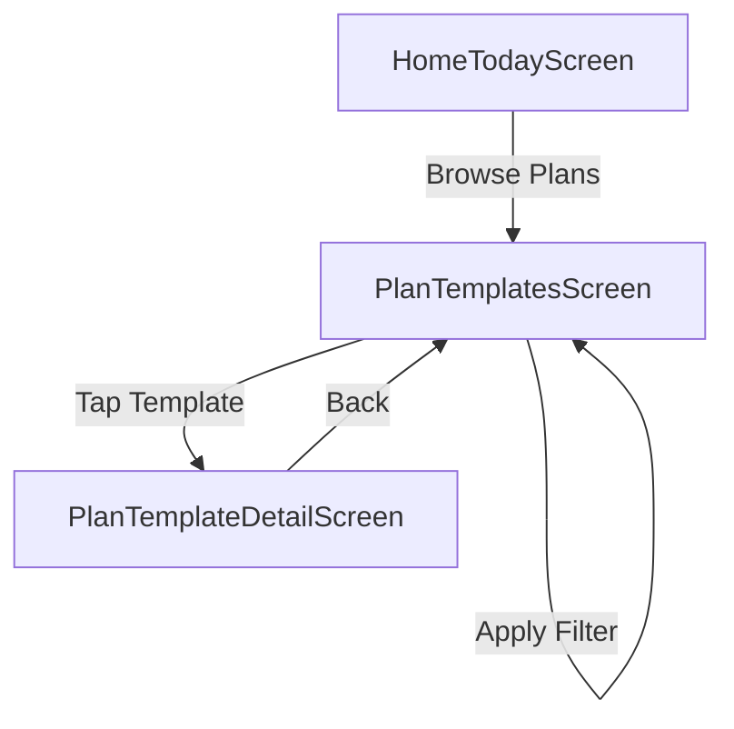

# PlanTemplatesScreen (P0.4)

## Artifact 1 — UI Flow Map

## Artifact 2 — UI Spec (Layout + States)
| UI Element | Layout Type | Description |
| :--- | :--- | :--- |
| **Header** | Sticky Header | Title "Choose a Plan" |
| **Filter Row** | Horizontal Scroll | Level chips (All, Beginner, etc.) and Days/Week chips. |
| **Plan List** | FlatList | Vertical list of Plan Cards. |
| **Plan Card** | Vertical Card | Name, Level Badge, Days/Week info, Equipment chips. Premium ribbon if applicable. |

### States
- **Loading**: Skeleton loaders representing the cards and filters.
- **Error**: Error message with "Try Again" button.
- **Empty**: "No plans match your filters" with a "Clear Filters" button.

## Artifact 3 — Component Tree
- `PlanTemplatesScreen` (Container)
  - `SafeAreaView`
    - `Header`
    - `FilterSection`
      - `FilterChip` (Level)
      - `FilterChip` (Days per Week)
    - `PlanList` (FlatList)
      - `PlanCard`
        - `PremiumBadge` (Optional)
        - `PlanTitle`
        - `PlanMeta` (Level, Days)
        - `EquipmentList` (Horizontal row of small chips)
    - `EmptyState` (Conditional)

## Artifact 4 — Navigation Contract
- **PlanTemplates** (route: `PlanTemplates`)
- **PlanTemplateDetail** (route: `PlanTemplateDetail`, params: `{ templateId: string }`)

## Artifact 5 — Firestore Reads/Writes
> [!NOTE]
> Currently using `WorkoutRepo` (Mock). Mapping for future Firestore:
- **Read**: `planTemplates` collection (Query with filters if possible).

## Artifact 6 — Firestore Schema Diff
No changes requested; assumes `planTemplates` collection exists.

## Artifact 7 — Security Rules Diff
No changes needed.

## Artifact 8 — Implementation Plan (React Native)
### 1. Repository & Data
- Update `IWorkoutRepository` to include `listPlanTemplates()`.
- Update `MockWorkoutRepository` to implement `listPlanTemplates()`.
- Enrich `planTemplates.json` mock data with `level`, `daysPerWeek`, `equipment`, `isPremium`, and `shortDescription`.

### 2. UI Implementation
- Update `PlanTemplatesScreen.tsx`.
- Implement level and frequency filters using local state.
- Create a `PlanCard` component with premium styling.
- Handle loading/error/empty states.

### 3. Analytics
- Track `plan_templates_viewed` on mount.
- Track `plan_filter_applied` on filter change.
- Track `plan_template_opened` on selection.

## Artifact 9 — Analytics Events
- `plan_templates_viewed`: On screen mount.
- `plan_filter_applied`: Params: `{ level: string, daysPerWeek: string }`.
- `plan_template_opened`: Params: `{ templateId: string }`.

## Artifact 10 — Test Checklist
- [ ] Verify all mock templates load initially.
- [ ] Apply "Intermediate" filter and verify list updates.
- [ ] Apply "5 days/week" filter and verify list updates.
- [ ] Select a template and verify navigation to `PlanTemplateDetail` with correct ID.
- [ ] Verify "Empty" state when no results match.

## Artifact 11 — Evidence Checklist
- **EVID-P0.4-PlanTemplates-001**: Screenshot: Full PlanTemplates list.
- **EVID-P0.4-PlanTemplates-002**: Screenshot: Applied filters with filtered results.
- **EVID-P0.4-PlanTemplates-003**: Screenshot: Empty state for strict filters.

## Acceptance Criteria
- User can see a list of available training plans.
- User can filter plans by experience level and training frequency.
- Cards show key info: Name, Level, Days, and Premium status.
- Tapping a card navigates to the details view.
- Loading state is shown while fetching plans.
