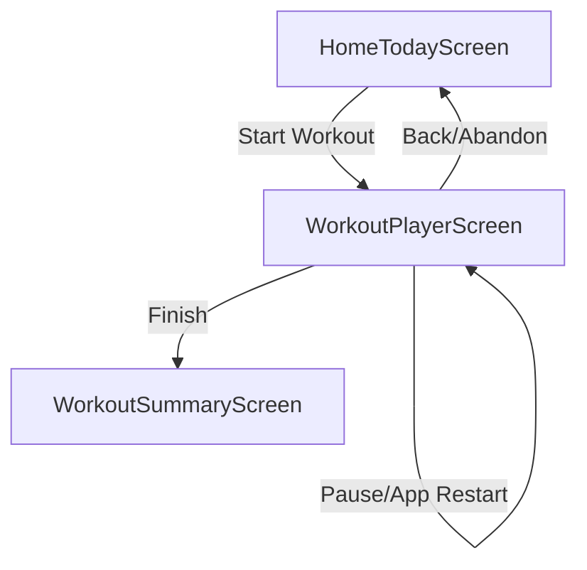

# WorkoutPlayerScreen (P0.5)

## Artifact 1 — UI Flow Map

## Artifact 2 — UI Spec (Layout + States)
| UI Element | Layout Type | Description |
| :--- | :--- | :--- |
| **Header** | Sticky | Name, Timer, "End" button (with confirm). |
| **Progress bar** | Horizonatal | Shows completed sets / total sets. |
| **Exercise Detail** | Scrollable | Exercise Name, Video/Img placeholder. |
| **Set Card** | Grid/Row | Target (reps/weight), Inputs (reps/weight), "Complete" toggle. |
| **Rest Overlay** | Transparent Modal | 60s countdown, "+15s", "Skip" buttons. |
| **Navigation btns** | Fixed Bottom | "Previous Exercise", "Next Exercise" / "Finish". |

### States
- **Loading**: Fetching workout or active plan.
- **RESTING**: Show rest timer modal.
- **COMPLETING**: Submitting summary to repository.

## Artifact 3 — Component Tree
- `WorkoutPlayerScreen` (Container)
  - `WorkoutHeader` (Name, Duration, EndBtn)
  - `ProgressBar`
  - `ExercisePager` (Horizontal ScrollView?)
    - `ExerciseView`
      - `ExerciseInfo`
      - `SetLoggerList`
        - `SetRow` (Inputs + Checkbox)
  - `RestTimerModal`
  - `PlayerControls` (Prev/Next/Finish)

## Artifact 4 — Navigation Contract
- **WorkoutPlayer** (params: `{ planId?: string }`)
- **WorkoutSummary** (params: `{ workoutId: string }`)

## Artifact 5 — Firestore Reads/Writes
> [!NOTE]
> Mock Implementation. Mapping for future:
- **Read/Write**: `users/${uid}/inProgressWorkout` (Singleton for persistence)
- **Increment**: `users/${uid}/metrics` (On completion)
- **Write**: `users/${uid}/history` (Completed session)

## Artifact 6 — Firestore Schema Diff
No changes needed.

## Artifact 7 — Security Rules Diff
No changes needed.

## Artifact 8 — Implementation Plan (React Native)
### 1. Repository
- Update `MockWorkoutRepository` with `startWorkout`, `getInProgressWorkout`, `logSet`, `updateWorkoutCursor`, `completeWorkout`.
- Use `AsyncStorage` to store the `in_progress` workout object.

### 2. UI Development
- Create `WorkoutPlayerScreen.tsx`.
- Implement local state for the active excise and set (cursor).
- Build the `RestTimer` logic (useEffect with setInterval).

### 3. Logic & Navigation
- Handle mounting: Check for in-progress workout first.
- Handle "Next" exercise: increment cursor and show rest timer if applicable.
- Handle "Finish": Aggregate logs, call `completeWorkout`, navigate to Summary.

## Artifact 9 — Analytics Events
- `workout_started`: { planId }
- `set_logged`: { exerciseId }
- `workout_completed`: { duration, totalSets }
- `workout_abandoned`: { reason }

## Artifact 10 — Test Checklist
- [ ] Verify workout resumes after app reload (simulated).
- [ ] Verify rest timer appears after clicking "Complete set".
- [ ] Verify summary calculation (total volume).
- [ ] Verify "Finish" button only appears on the last exercise.

## Artifact 11 — Evidence Checklist
- **EVID-P0.5-WorkoutPlayer-001**: Screenshot: Set logging UI.
- **EVID-P0.5-WorkoutPlayer-002**: Screenshot: Rest timer overlay.
- **EVID-P0.5-WorkoutPlayer-003**: Video: Complete flow from Start to Summary.

## Acceptance Criteria
- Seamless resume on app restart.
- Timer tracking accurate while screen is active.
- Rest timer gating between sets/exercises.
- Summary correctly aggregates all logged data.
