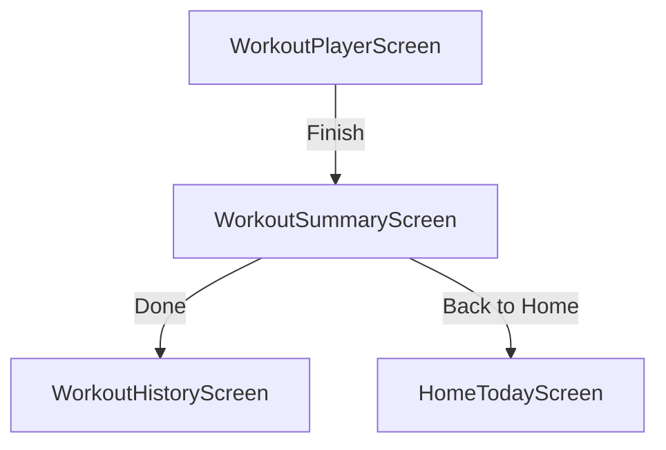

# WorkoutSummaryScreen (P0.5)

Build WorkoutSummaryScreen to display a recap after completion.

## Artifact 1 — UI Flow Map

## Artifact 2 — UI Spec (Layout + States)
| UI Element | Layout Type | Description |
| :--- | :--- | :--- |
| **Header** | Sticky | "Workout Complete" title + Workout Name subtitle. |
| **Summary Tiles** | 3-Column Row | Duration (mins), Total Sets, Total Volume (Reps * Weight). |
| **Exercise Recap List** | Scrollable List | Grouped by Exercise. Shows name, total sets, and "Best Set" highlight. |
| **Primary CTA** | Full-width Button | "Done" -> Navigates to history tab. |
| **Secondary CTA** | Ghost Button | "Back to Home" -> Navigates to today tab. |

### States
- **Loading**: Centered ActivityIndicator.
- **Error**: Error message with "Retry" button.
- **Not Found**: "Workout not found" fallback with "Back to Home" CTA.

## Artifact 3 — Component Tree
- `WorkoutSummaryScreen` (Container)
  - `SafeAreaView`
    - `ScrollView`
      - `SummaryHeader` (Title, Workout Name)
      - `SummaryStrip` (Duration, Sets, Volume tiles)
      - `ExerciseRecapSection`
        - `RecapCard` (per Exercise)
          - `ExerciseName`
          - `StatsLine` (Sets, Best Set)
    - `Footer`
      - `DoneButton`
      - `HomeButton`

## Artifact 4 — Navigation Contract
- **WorkoutSummary** (params: `{ workoutId: string }`)
- Redirects to:
  - `MainTabs` -> `WorkoutHistory`
  - `MainTabs` -> `HomeToday`

## Artifact 5 — Firestore Reads/Writes
> [!NOTE]
> Currently using `WorkoutRepo` (Mock). Mapping for future Firestore:
- **Read**: `users/${uid}/history/${workoutId}` (Header & Summary)
- **Read**: `users/${uid}/history/${workoutId}/sets` (Recap data)

## Artifact 6 — Firestore Schema Diff
Updated `completeWorkout` repository logic to persist full session snapshot (sets) instead of just summary log.

## Artifact 7 — Security Rules Diff
No changes needed.

## Artifact 8 — Implementation Plan (React Native)
### 1. Repository Extensions
- Add `getWorkoutDetail(uid, workoutId)` to `IWorkoutRepository`.
- Update `MockWorkoutRepository.completeWorkout` to save detailed metadata.
- Implement logic to compute "Best Set" per exercise.

### 2. UI Implementation
- Create `WorkoutSummaryScreen.tsx` in `features/workout`.
- Implement summary calculation logic (if not provided by repo).
- Style tiles with `Colors.card` and `brandPurple` accents.

### 3. Polish
- Add subtle entrance animations for summary tiles.
- Ensure volume units are handled correctly.

## Artifact 9 — Analytics Events
- `workout_summary_viewed`: { workoutId }
- `workout_summary_done_clicked`: Navigating to history.
- `workout_summary_home_clicked`: Navigating to home.

## Artifact 10 — Test Checklist
- [ ] Load summary for a recently completed workout.
- [ ] Verify Duration matches timer from player.
- [ ] Verify Total Volume matches sum of (reps * weight) for all completed sets.
- [ ] Verify Best Set logic picks the set with highest (reps * weight) or (weight).
- [ ] Click "Done" and verify navigation to History tab.

## Artifact 11 — Evidence Checklist
- **EVID-P0.5-WorkoutSummary-001**: Screenshot: Full summary with tiles and recap.
- **EVID-P0.5-WorkoutSummary-002**: Screenshot: Loading and Error states.

## Acceptance Criteria
- Displays accurate duration, sets, and volume.
- Groups recap by exercise name.
- Highlights a "Best Set" for each exercise.
- Navigation buttons work as described.
- Handles guest sessions correctly (persistent in Mock repo).
