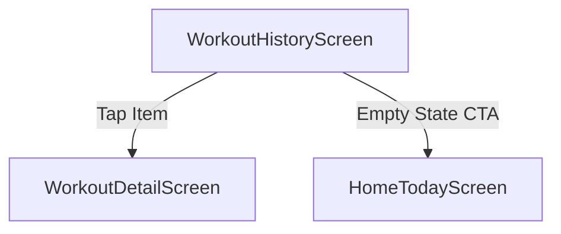

# WorkoutHistoryScreen (P0.6)

Build WorkoutHistoryScreen listing completed workouts to provide users with a record of their progress.

## Artifact 1 — UI Flow Map

## Artifact 2 — UI Spec (Layout + States)
| UI Element | Layout Type | Description |
| :--- | :--- | :--- |
| **Header** | Sticky | Title "History". |
| **Workout List** | FlatList | Scrollable list of completed sessions. |
| **Workout Item** | Row/Card | Date (MMMM D, YYYY), Name, Duration (MM:SS), and Volume (kg). |
| **Empty State** | Centered | "Complete a workout to see it here." + "Start Workout" button. |

### States
- **Loading**: Pulse-style ActivityIndicator centered.
- **Empty**: Informative message with CTA to start a workout.
- **Error**: Error message with "Retry" button.

## Artifact 3 — Component Tree
- `WorkoutHistoryScreen` (Container)
  - `SafeAreaView`
    - `Header` ("History")
    - `ContentArea`
      - `LoadingState` (conditional)
      - `EmptyState` (conditional)
      - `ErrorState` (conditional)
      - `FlatList`
        - `HistoryItem` (Card)
          - `DateText` (e.g., February 1, 2026)
          - `NameText` (e.g., Full Body Foundation)
          - `MetricsRow` (Duration, Volume)

## Artifact 4 — Navigation Contract
- **WorkoutHistory** (Route in MainTabs)
- Navigates to:
  - `WorkoutDetail` (params: `{ workoutId: string }`)
  - `HomeToday` (via tab switch)

## Artifact 5 — Firestore Reads/Writes
> [!NOTE]
> Currently using `WorkoutRepo` (Mock). Future Firestore:
- **Query**: `users/${uid}/history` where `status == 'completed'` order by `startedAt` desc.

## Artifact 6 — Firestore Schema Diff
No schema changes. Using existing `history_details` storage in Mock repo.

## Artifact 7 — Security Rules Diff
No changes needed.

## Artifact 8 — Implementation Plan (React Native)
### 1. Repository Extensions
- Add `listWorkouts(uid, options)` to `IWorkoutRepository`.
- Implement `listWorkouts` in `MockWorkoutRepository` by filtering `history_details`.

### 2. UI Implementation
- Create `WorkoutHistoryScreen.tsx` in `features/history`.
- Use `date-fns` or native `Intl` for friendly date formatting.
- Style list items with `Colors.card` and consistent spacing.

### 3. Logic
- Fetch history on mount.
- Implement pull-to-refresh.
- Navigate to `WorkoutDetail` on item press.

## Artifact 9 — Analytics Events
- `history_viewed`
- `history_item_opened`: { workoutId }

## Artifact 10 — Test Checklist
- [ ] Load screen with 0 workouts -> Verify empty state + CTA.
- [ ] Complete a workout -> Verify it appears at the top of the history list.
- [ ] Verify Date is formatted correctly (e.g., "January 29, 2026").
- [ ] Tap a workout -> Verify navigation to `WorkoutDetail` (even if placeholder).
- [ ] Tap "Start Workout" in empty state -> Verify navigation to Today tab.

## Artifact 11 — Evidence Checklist
- **EVID-P0.6-WorkoutHistory-001**: Screenshot: History list with multiple entries.
- **EVID-P0.6-WorkoutHistory-002**: Screenshot: Empty state.

## Acceptance Criteria
- List displays completed workouts only.
- Items are ordered by date descending (newest first).
- Displays duration and volume for each workout.
- Handles empty and loading states gracefully.
